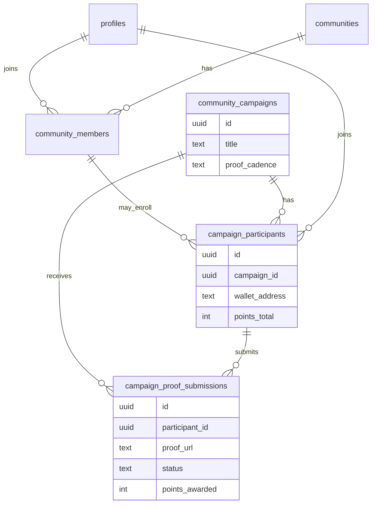
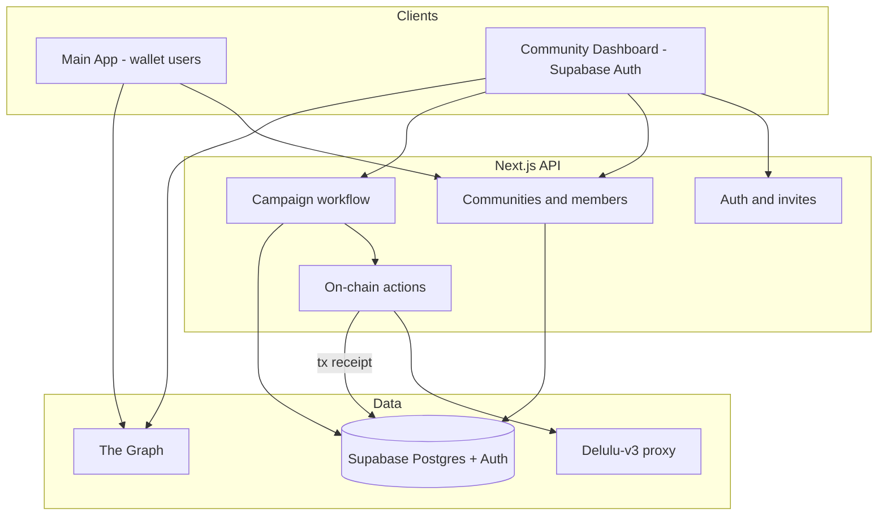
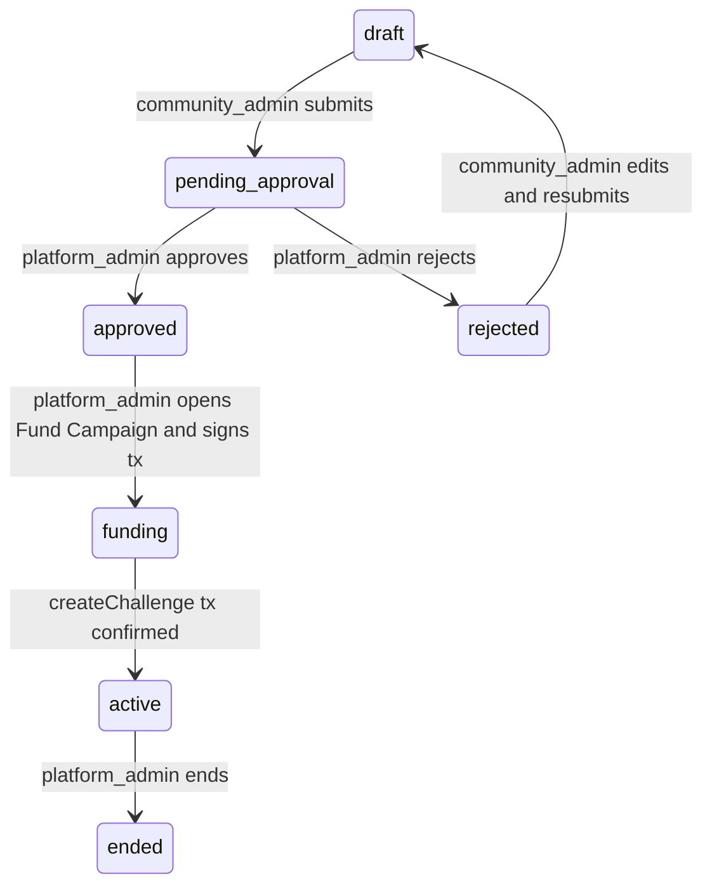
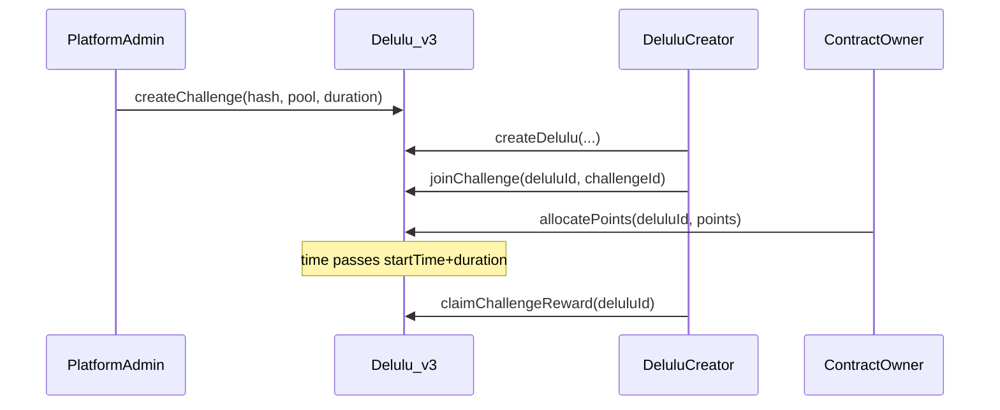
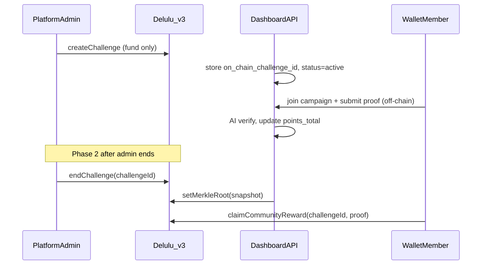
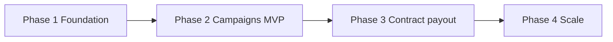

# Community-Based Delulu — Fresh Architecture Plan

> Greenfield multi-tenant community layer for Delulu: platform admins create communities and invite sub-admins via Supabase Auth; sub-admins propose challenges that platform admins approve and fund on-chain; wallet users join communities and opt into campaigns separately (many-to-many for both); campaign lifecycle is governed off-chain with a contract upgrade for admin-controlled close.

## Guiding principles

- **Do not extend** the current admin allowlist model (`ADMIN_OPS_ALLOWED_EMAILS`). Replace with **database-driven RBAC** + [Supabase Auth](https://supabase.com/docs/guides/auth).
- **On-chain stays minimal**: prize pool, joins, points, claims. Everything social/organizational lives in **Postgres (Supabase)**.
- **Multi-tenant by `community_id`** on every query and API check — designed for many communities and sub-admins from day one.
- **Phased delivery**: ship auth + communities + approval workflow before contract changes; avoid blocking MVP on a mainnet upgrade.

---

## Roles and permissions

| Role | Who | Can do |
|------|-----|--------|
| `platform_admin` | Delulu core team | Create/archive communities, invite sub-admins, **approve/reject** campaigns, **fund approved campaigns** (separate step), end campaigns, see all data |
| `community_admin` | Sub-admin per community | Manage one or more assigned communities, propose campaigns, view members/leaderboards, share member invite codes |
| `member` | Wallet user in main app | Join communities via code; **opt into campaigns**; **the campaign is the shared delulu** — submit proof and earn points (no personal delulu per campaign) |

### Campaign = the delulu (shared goal)

Community campaigns are **not** pools that personal delulus join. Each campaign **is** the delulu:

- Example: *"Walk 10,000 steps daily"* is one campaign = one shared goal.
- Users **join the campaign** to participate in that goal directly.
- They **submit proof** (photo, screenshot, etc.) against the campaign on a schedule defined by the campaign (daily, weekly, etc.).
- **Points accumulate per participant** in the campaign leaderboard from verified proofs and existing bonus rules (early submit, streaks where applicable).
- **No** `createDelulu` + `joinChallenge` flow for members in community campaigns.

This is separate from the **existing personal delulu** product (stake your own goal, milestones, tips) — that stays for non-community use. Community campaigns use a **campaign-centric, mostly off-chain** participation model with an on-chain **prize pool only**.

### Membership model (wallet users)

Community membership and campaign participation are **two independent relationships**:



**Rules**
- A user may belong to **multiple communities** (`community_members`).
- A user may join **multiple campaigns** (`campaign_participants` — opt-in per campaign).
- Joining a community does **not** enroll the user in campaigns.
- To participate: (1) active `community_member`, (2) join campaign → `campaign_participants`, (3) submit proofs while campaign is `active`.
- User can be in Community A, skip Campaign X, join Campaign Y.

**Default assumptions**
- **Pool funding**: platform admin funds in a **dedicated Fund Campaign flow** after approval (approve ≠ fund).
- **Points**: from verified **proof submissions** on the campaign — no manual allocation in the dashboard UI.

Permission checks live in [`apps/web/src/lib/dashboard/authorize.ts`](../apps/web/src/lib/dashboard/authorize.ts) — not scattered in pages.

---

## Points and leaderboards (proof-based, off-chain for community campaigns)

**Product rule**: no manual point allocation by admins. Points come from **verified proof submissions** on the campaign (reuse AI verification patterns from [`/api/ai/verify-milestone`](../apps/web/src/app/api/ai/verify-milestone)).

| Source | Community campaign | Personal delulu (existing) |
|--------|-------------------|---------------------------|
| Proof verified | Yes — primary | Milestone verified on-chain |
| Early submission bonus | Yes — off-chain rules | On-chain |
| Streak / consecutive days | Yes — off-chain | On-chain streak bonus |
| Tips | Optional later | On-chain |

**Leaderboard**: rank `campaign_participants` by `points_total` (Supabase). Community dashboard and main app read the same table (cached at scale).

**On-chain prize pool**: `createChallenge` holds the pool. Members do **not** call `joinChallenge`. **Phase 2 contract upgrade**: distribute pool pro-rata by **final off-chain points snapshot** at campaign end (merkle claim or admin-triggered batch), replacing per-delulu `claimChallengeReward` for community campaigns.

---

## High-level architecture



**Source of truth split**

| Concern | Store |
|---------|--------|
| Communities, sub-admin assignments, invites, community roster | Supabase |
| Campaign metadata, approval state, extensions, ended flag | Supabase |
| **Per-user campaign enrollment + points** | Supabase `campaign_participants`, `campaign_proof_submissions` |
| **Proof verification + point awards** | Supabase (AI verify API); optional mirror to chain later |
| Prize pool only | On-chain `createChallenge` / future merkle payout |
| Link | `community_campaigns.on_chain_challenge_id` |

---

## Fresh Supabase schema (new tables)

Add a new SQL doc: [`COMMUNITIES_SCHEMA.sql`](./COMMUNITIES_SCHEMA.sql). Keep existing `profiles` for wallet users; **staff accounts** link to Supabase Auth `auth.users` via `staff_users`.

```sql
-- Staff users (platform admin + community sub-admin) — FK to Supabase Auth
staff_users (
  id            uuid primary key references auth.users(id) on delete cascade,
  email         text not null unique,
  display_name  text,
  global_role   text not null default 'community_admin', -- platform_admin | community_admin
  created_at    timestamptz default now()
)

communities (
  id            uuid primary key default gen_random_uuid(),
  name          text not null,
  slug          text not null unique,
  description   text,
  member_invite_code text not null unique,  -- for wallet users joining community
  status        text not null default 'active', -- active | archived
  created_by    uuid references staff_users(id),
  created_at    timestamptz default now()
)

community_admin_assignments (
  community_id  uuid references communities(id) on delete cascade,
  staff_user_id   uuid references staff_users(id) on delete cascade,
  status        text not null default 'active', -- pending | active | revoked
  invited_by    uuid references staff_users(id),
  created_at    timestamptz default now(),
  primary key (community_id, staff_user_id)
)

staff_invites (
  id            uuid primary key default gen_random_uuid(),
  email         text not null,
  community_id  uuid references communities(id), -- null = platform_admin invite
  role          text not null, -- platform_admin | community_admin
  token_hash    text not null unique,
  expires_at    timestamptz not null,
  accepted_at   timestamptz,
  invited_by    uuid references staff_users(id),
  created_at    timestamptz default now()
)

community_members (
  id            uuid primary key default gen_random_uuid(),
  community_id  uuid not null references communities(id) on delete cascade,
  wallet_address text not null references profiles(address),
  status        text not null default 'active',
  joined_via    text, -- invite_code | admin_added
  last_seen_at  timestamptz, -- for active-user stats
  joined_at     timestamptz default now(),
  unique (community_id, wallet_address)
)

-- Opt-in campaign participation (campaign IS the delulu — no personal on-chain delulu)
campaign_participants (
  id                    uuid primary key default gen_random_uuid(),
  campaign_id           uuid not null references community_campaigns(id) on delete cascade,
  wallet_address        text not null references profiles(address),
  points_total          integer not null default 0,
  current_streak        integer not null default 0,
  status                text not null default 'joined', -- joined | withdrawn
  joined_at             timestamptz default now(),
  unique (campaign_id, wallet_address)
)

campaign_proof_submissions (
  id                    uuid primary key default gen_random_uuid(),
  campaign_id           uuid not null references community_campaigns(id) on delete cascade,
  participant_id        uuid not null references campaign_participants(id) on delete cascade,
  wallet_address        text not null,
  proof_url             text not null,
  status                text not null default 'pending', -- pending | approved | rejected
  points_awarded        integer not null default 0,
  ai_verdict            jsonb,
  submitted_at          timestamptz default now(),
  reviewed_at           timestamptz
)

community_campaigns (
  id                    uuid primary key default gen_random_uuid(),
  community_id          uuid not null references communities(id),
  proposed_by           uuid references staff_users(id),
  title                 text not null,           -- e.g. "Walk 10,000 steps daily"
  description           text,
  proof_cadence         text not null default 'daily', -- daily | weekly | custom
  proof_instructions    text,                   -- what to submit
  content_hash          text,              -- IPFS hash after approval prep
  proposed_pool_amount  numeric not null,
  on_chain_challenge_id bigint unique,     -- prize pool only
  status                text not null,     -- see state machine below
  display_ends_at       timestamptz,       -- off-chain soft deadline (extendable)
  ended_at              timestamptz,
  ended_by              uuid references staff_users(id),
  approved_by           uuid references staff_users(id),
  approved_at           timestamptz,
  rejection_reason      text,
  created_at            timestamptz default now(),
  updated_at            timestamptz default now()
)

campaign_status_events (audit log for scaling/debug)
community_campaign_extensions (optional: history of display_ends_at changes)
```

**Indexes**: `(community_id, status)`, `(on_chain_challenge_id)`, `(wallet_address, community_id)`, `(campaign_id, wallet_address)`, `(wallet_address)` on `campaign_participants`, `(email)` on invites.

---

## Campaign state machine (off-chain)



### Approve vs fund (separate actions)

| Step | Who | What happens |
|------|-----|----------------|
| **Approve** | platform_admin | Review proposal → `status = approved` → **email sub-admin** (campaign accepted, awaiting funding) → IPFS prep for title/description |
| **Fund** | platform_admin | Dedicated **Fund Campaign** UI → connect wallet → `createChallenge` with proposed pool → `status = funding` → `active` on tx confirm |

Sub-admin is **notified on approval**, not on funding completion (optional second email when live).

### Email: campaign accepted

When platform admin approves (`pending_approval` → `approved`):

- Send Resend email to **proposing sub-admin** (`staff_users.email` via `proposed_by`).
- Template: campaign title, community name, proposed pool, link to `/dashboard/communities/[id]/campaigns/[campaignId]`.
- Log in `campaign_status_events` with `event = approved_notified`.

Future: queue via Inngest at scale; sync Resend in API for MVP.

- **Extend duration**: update `display_ends_at` only (no on-chain change in MVP).
- **End campaign**: platform admin sets `status = ended`, `ended_at`, then calls on-chain close (after contract upgrade).

---

## Auth — Supabase Auth ([official guide](https://supabase.com/docs/guides/auth))

Staff dashboard auth uses **Supabase Auth only** (separate from wallet/Web3Auth in the main app).

### How it works

Per [Supabase Auth docs](https://supabase.com/docs/guides/auth):
- **Authentication**: email + password (invite flow for sub-admins); JWT issued on login.
- **Authorization**: app-level RBAC via `staff_users.global_role` + `community_admin_assignments` (optionally RLS later).

### Implementation stack

| Layer | Choice |
|-------|--------|
| Client | `@supabase/ssr` — `createBrowserClient` for login forms |
| Server | `createServerClient` in middleware + route handlers — cookie session refresh |
| Invites | Supabase Admin API `auth.admin.inviteUserByEmail` or `signUp` after invite token validation |
| Session | JWT in HTTP-only cookies; `auth.getUser()` on each request |
| Staff profile | `staff_users` row keyed to `auth.users.id` |

### Replace current admin auth entirely

| Remove / deprecate | Replace with |
|--------------------|--------------|
| `ADMIN_OPS_ALLOWED_EMAILS` env gate | `staff_users` + role checks |
| `pnpm seed:admin` as sole bootstrap | Seed one `platform_admin` in Supabase Auth + `staff_users`; all others via invite |
| Fixed `role: "ops"` session | `{ staffUserId, globalRole, communityIds[] }` from `staff_users` |

### Sub-admin invite flow

1. Platform admin creates community in **Community Dashboard**.
2. Platform admin invites email → `staff_invites` row + Resend email.
3. Link: `/dashboard/accept-invite?token=...`
4. User sets password via Supabase Auth (`inviteUserByEmail` or `signUp` after token check).
5. Create `staff_users` + `community_admin_assignments` → redirect by role.

### Member auth (main app) — unchanged

Wallet users stay on **Web3Auth**; community/campaign APIs authenticate by wallet address, not Supabase Auth.

### Member invite flow (main app)

1. Sub-admin shares `member_invite_code` or `/join/{code}`.
2. Wallet user authenticates (Web3Auth).
3. API upserts `community_members`.

### Campaign join + proof flow (main app)

**Join** (one tap — no delulu creation):

1. User browses active campaigns in communities they belong to.
2. Taps **Join campaign** → `campaign_participants` row created.
3. User is now participating in that shared delulu.

**Submit proof** (repeat while campaign active):

1. User opens campaign page → **Submit proof** (upload / link).
2. `POST /api/community/campaigns/[id]/proof` → `campaign_proof_submissions` (`pending`).
3. AI verify (adapt existing milestone verifier) → on approve: increment `campaign_participants.points_total`, apply streak/early bonuses.
4. Leaderboard updates immediately from `points_total`.

**Leaving**: `status = withdrawn` on participant; past proofs and points remain for history; no new submissions.

### Middleware

- `/dashboard/*` — any valid `staff_users` row (shared dashboard).
- `/dashboard/approvals`, `/dashboard/funding`, `/dashboard/communities/new` — `platform_admin` only.
- `/dashboard/communities/[communityId]/*` — `platform_admin` OR active assignment for that community.
- API routes mirror the same checks; never trust client-sent `communityId` without authorization.

---

## Naming: Community Dashboard (not “ops”)

User-facing name: **Community Dashboard** (or **Delulu Dashboard** in nav). Routes: `/dashboard/*`. API: `/api/dashboard/*`.

| Surface | Who | Auth |
|---------|-----|------|
| **Community Dashboard** | Platform admin + sub-admins | [Supabase Auth](https://supabase.com/docs/guides/auth) — email + password |
| **Main app** | Wallet members | Web3Auth |

Never use “ops” in UI copy, URLs, or docs aimed at staff. Internal table names: `staff_users`, `staff_invites`.

---

## UI — Pinterest-minimal Community Dashboard

**Design direction:** Calm, visual-first, **Pinterest-like** staff dashboard — card grids, generous whitespace, almost no paragraph copy on pages. **Light only** (no dark sidebar, no dark chrome anywhere on `/dashboard`).

**Do not** extend legacy [`admin-shell.tsx`](../apps/web/src/app/admin/admin-shell.tsx) dark sidebar. Build a **new** shell under `apps/web/src/app/dashboard/`.

### Design principles

| Principle | Rule |
|-----------|------|
| **Visual over verbal** | Lead with cards, numbers, status chips, avatars — not paragraphs |
| **One primary action per screen** | Single obvious CTA (e.g. “New community”, “Propose campaign”) |
| **Modals for workflows** | Create, invite, approve, reject, fund, end → **modal or slide-over sheet** — never a full page of form labels |
| **Sparse copy** | Page subtitle max **one short line**; helper text lives in modals or tooltips |
| **Progressive disclosure** | Details on click (card → detail page or side panel); queue items expand inline |
| **Empty states** | Illustration + one line + one button — no walls of instructions |

### Tokens (align with main app)

| Token | Value |
|-------|--------|
| Canvas | `#f9f8f4` |
| Surface (cards, sidebar) | `#ffffff` |
| Text primary | `#1a1a19` |
| Text muted | `#6b6b66` |
| Accent | `#2563eb` (delulu-blue) |
| Border | `#e8e8e3` (subtle) |
| Radius | `rounded-2xl` on cards; `rounded-xl` on buttons |
| Shadow | `shadow-sm` only — no heavy elevation |

### Shell layout

```
┌──────────┬─────────────────────────────────────────────┐
│  Light   │  Top bar: community context · search · user │
│  nav     ├─────────────────────────────────────────────┤
│  (icons  │                                             │
│  + short │     Masonry / card grid (main content)      │
│  labels) │                                             │
│  ~200px  │                                             │
└──────────┴─────────────────────────────────────────────┘
```

- **Sidebar:** white background, `border-r border-[#e8e8e3]`, charcoal icons, blue active state (pill or left bar) — **never** `#1a1a19` dark fill
- **Nav items:** icon + 2-word label max; hide items the role cannot use (don’t show disabled links)
- **Top bar:** page title (single line), optional search on list pages, avatar menu (logout, settings)
- **Content max-width:** `max-w-6xl` centered on form-heavy flows; grids can use full width

### Shared components (new `dashboard-ui.tsx`)

Build alongside Phase 1.3 — do not reuse dark admin patterns:

- `DashboardShell` — light sidebar + top bar
- `DashboardCard` — Pinterest tile (image/icon area, title, meta row, status chip)
- `DashboardCardGrid` — responsive masonry-style columns (`grid-cols-1 sm:2 lg:3`)
- `DashboardModal` / `DashboardSheet` — all create/confirm flows
- `DashboardStat` — single number + tiny label (no paragraph)
- `DashboardEmpty` — icon + title + one CTA
- `StatusChip` — `draft` · `pending` · `approved` · `active` · `ended` (color only, no sentence)
- `DashboardToast` — copy invite code, saved, email sent

---

### Per-route UX (every `/dashboard` path)

#### `/dashboard/login`

- **Layout:** Centered card on `#f9f8f4` — **no sidebar**
- **Content:** Logo, “Community Dashboard”, email + password, sign in — **no marketing copy**
- **Errors:** Inline under field only

#### `/dashboard` (home)

| Role | Layout |
|------|--------|
| `platform_admin` | 3–4 stat tiles (communities, pending approvals, awaiting fund, members) + **card grid of communities** (same cards as `/communities`) |
| `community_admin` (1 community) | Redirect to `/dashboard/communities/[id]` |
| `community_admin` (2+) | **Community picker grid** only — each card: name, member count, active campaigns chip |

- **No** long welcome text or feature lists

#### `/dashboard/communities`

- **Layout:** Top bar title “Communities” + **primary button** “New community” (platform_admin only) → **opens modal**
- **Body:** `DashboardCardGrid` — each card: cover color block or initial avatar, name, member count, campaign count, status chip
- **Click card** → `/dashboard/communities/[id]`
- **Empty:** “No communities yet” + New community (modal)

#### `/dashboard/communities/new`

- **Do not use a dedicated page** — **modal from list or home** with: name, slug (auto from name), description (optional, collapsed “More”), submit
- If route exists for deep-linking, render same form in a centered narrow card (not full dashboard essay)

#### `/dashboard/communities/[id]` (community hub)

- **Hero row:** Community name + `StatusChip` · **icon buttons**: copy invite code (toast), invite sub-admin (modal, platform_admin)
- **Stats row:** 3 `DashboardStat` tiles — members, active campaigns, pending (role-dependent)
- **Campaigns section:** Card grid of campaigns (title, status, pool amount if approved+, participant count if active)
- **CTA:** “Propose campaign” → **sheet/modal** (Phase 2) — not a navigation to a text-heavy page
- **No** inline invite instructions paragraph — tooltip on copy button only

#### `/dashboard/communities/[id]/campaigns/new`

- **Sheet or large modal** — not a standalone sparse page
- Fields: title, cadence (segmented control: daily / weekly), pool amount (read-only for sub-admin), instructions (textarea, 3 rows max)
- Footer: Save draft · Submit for approval
- **Phase 1:** route omitted entirely

#### `/dashboard/communities/[id]/campaigns/[campaignId]`

- **Top:** Campaign title + `StatusChip` + kebab menu (actions by role/status)
- **Body (2 columns on desktop):**
  - **Left:** Timeline strip (submitted → approved → funded → active) — icons only, labels on hover
  - **Right:** Leaderboard table (rank, avatar, points) — compact, no prose
- **Actions via modal:**
  - Platform admin: Approve · Reject (reason field) · Fund · End
  - Sub-admin: Edit draft · Resubmit
- **Phase 1:** route omitted

#### `/dashboard/approvals` (platform_admin)

- **Layout:** Queue as **card grid** or single-column cards — each card: campaign title, community name, proposed pool, proposer email, **Approve** / **Reject** buttons
- **Approve** → confirmation modal (summary + confirm) → triggers email
- **Reject** → modal with single reason field
- **No** full campaign description on card — “View details” opens sheet with IPFS preview if needed
- **Empty:** “Nothing to review”

#### `/dashboard/funding` (platform_admin)

- **Layout:** Cards for `approved` campaigns awaiting fund — pool amount, community, content hash truncated
- **Fund** → **modal:** amount (read-only), connect wallet, confirm tx, progress states (signing → confirming → done)
- **Not** a page of wallet instructions — status in modal steps only
- **Phase 1:** route omitted (hide nav item)

#### `/dashboard/accept-invite` (public)

- **Layout:** Centered card (like login) — set password, confirm password, accept
- **No sidebar** until redirect after success

---

### Modal inventory (single source of truth)

| Action | Surface |
|--------|---------|
| Create community | Modal |
| Invite sub-admin | Modal |
| Propose / edit campaign | Sheet (side panel) |
| Approve campaign | Modal (confirm) |
| Reject campaign | Modal (reason) |
| Fund campaign | Modal (wallet + tx) |
| End campaign | Modal (confirm + warning) |
| Copy member invite code | Toast |
| Logout | Dropdown menu item |

**Rule:** If it’s a form or confirmation, it’s a modal/sheet — **never** a new page with stacked labels unless unavoidable (login, accept-invite).

---

### What to avoid

- Dark sidebar or charcoal nav background
- `AdminPageHeader` with long `description` paragraphs on every page
- Dedicated `/new` pages that duplicate modal content
- Tables with 8+ columns on first paint — use cards, drill down
- Showing platform_admin actions as disabled gray buttons to sub-admins — **hide** instead
- Alert banners with multi-sentence policy text

---

### Role → routing after login

| Role | Default redirect | Sidebar highlights |
|------|------------------|-------------------|
| `platform_admin` | `/dashboard` | Overview, All communities, **Approvals**, **Funding**, End campaign, Settings |
| `community_admin` (1 community) | `/dashboard/communities/[id]` | That community: Campaigns, Members, Invite code, Leaderboards |
| `community_admin` (2+ communities) | `/dashboard` (community picker) | Same per-community items when inside a community |

### Role → what each person can see / do

| Feature | platform_admin | community_admin |
|---------|----------------|-----------------|
| Create community | Yes | No |
| Invite sub-admin | Yes | No |
| Approve / reject campaign | Yes | No |
| Fund campaign (`/dashboard/funding`) | Yes | No |
| End campaign | Yes | No |
| Propose campaign (draft → submit) | Yes (if needed) | Yes (own communities) |
| View community stats / leaderboard | All communities | Assigned communities only |
| Member invite code | Yes | Yes (own communities) |
| Global platform metrics | Yes | No |

Unauthorized routes return **403** or redirect to their default home — never show disabled admin actions to sub-admins.

### Middleware (one dashboard tree)

- `/dashboard/*` — any authenticated `staff_users` row.
- `/dashboard/approvals`, `/dashboard/funding`, `/dashboard/communities/new` — `platform_admin` only.
- `/dashboard/communities/[id]/*` — `platform_admin` OR active `community_admin_assignments` for that `id`.

---

## Dashboard routes (shared tree, role-gated nav)

All routes live under **one** `/dashboard` tree. Nav hides items the role cannot use.

| Route | Visible to | Features |
|-------|------------|----------|
| `/dashboard` | both | Role-specific home (global overview vs community picker) |
| `/dashboard/communities` | platform_admin (all); sub-admin (mine only) | Card grid; **New community modal** |
| `/dashboard/communities/new` | platform_admin | Optional deep-link — same as modal in narrow card (no full page) |
| `/dashboard/communities/[id]` | both (scoped) | Hub: stats + campaign cards + invite toast / invite modal |
| `/dashboard/communities/[id]/campaigns/new` | community_admin (+ platform_admin) | **Sheet** — draft → submit (Phase 2) |
| `/dashboard/communities/[id]/campaigns/[campaignId]` | both (scoped) | Timeline + leaderboard; actions in modals |
| `/dashboard/approvals` | platform_admin | Card queue; approve/reject **modals** |
| `/dashboard/funding` | platform_admin | Card grid; fund **wallet modal** |
| `/dashboard/accept-invite` | public (token) | Set password, then route by role |

### Main app (wallet users) — unchanged, separate product surface

| Route | Audience | Features |
|-------|----------|----------|
| `/communities` | member | My communities — all memberships across the platform |
| `/communities/[slug]` | member | Community hub: member roster context, browse **active** campaigns (join individually) |
| `/communities/[slug]/campaigns/[id]` | member | Campaign = delulu: **Join**, **Submit proof**, leaderboard, points |

Reuse Delulu tokens from [`globals.css`](../apps/web/src/app/globals.css) but **new** [`dashboard-ui.tsx`](../apps/web/src/components/dashboard/dashboard-ui.tsx) — not dark [`admin-shell.tsx`](../apps/web/src/app/admin/admin-shell.tsx) or paragraph-heavy [`admin-ui.tsx`](../apps/web/src/components/admin/admin-ui.tsx) headers.

---

## On-chain strategy

### Contract compatibility audit ([`Delulu-v3.sol`](../apps/contracts/contracts/Delulu-v3.sol))

The community plan is **mostly off-chain** by design. Today’s contract was built for **personal delulus joining admin challenges**, not wallet-direct community campaigns. Below is what works now vs what requires a **UUPS upgrade** (contract is upgradeable via `onlyOwner`).

#### Compatibility matrix

| Plan requirement | Current contract | Status |
|------------------|------------------|--------|
| Platform admin funds prize pool via `createChallenge` | `createChallenge(contentHash, poolAmount, duration)` — pulls `currency` ERC-20, sets `challengeFunder = msg.sender`, `active = true` | **Supported** |
| Long off-chain campaign duration (MVP) | No max `duration`; pass large value (e.g. 10 years) at fund time | **Supported** |
| Link campaign to chain id | Store `on_chain_challenge_id` from `ChallengeCreated` event | **Supported** |
| Members join campaign without personal delulu | No participant registry; `joinChallenge` requires existing `deluluId` + creator is `msg.sender` | **Not supported** — intentionally skipped off-chain |
| Points from proof verification | `allocatePoints(deluluId, points)` is `onlyOwner` and per-delulu; no wallet-level points | **Not used** for community campaigns (off-chain only) |
| Admin ends campaign on toggle | No `endChallenge()`; close is **wall-clock only** (`block.timestamp > startTime + duration`) | **Not supported** — Phase 2 |
| Payout by off-chain points snapshot | `claimChallengeReward(deluluId)` pays **delulu creator** pro-rata via `d.points / c.totalPoints` | **Not supported** for community model — Phase 2 merkle |
| Funder recovers unused pool | `refundChallengePool(challengeId)` — funder only, after time expiry, transfers full stored `poolAmount` | **Partial** — time-gated only; does not decrement for prior claims (legacy personal-delulu flow) |
| Subgraph: pool funded / ended | `ChallengeCreated`, `ChallengeRewardClaimed`, `DeluluJoinedChallenge` indexed; **no** `ChallengePoolRefunded` handler | **Partial** — add handlers in Phase 2 |

#### How the current challenge model works (personal delulu)



Community campaigns **do not use** `createDelulu`, `joinChallenge`, `allocatePoints`, or `claimChallengeReward(deluluId)`.

#### How the community plan uses chain (target)



#### MVP (Phases 1–2, no contract upgrade)

- On fund: `createChallenge` with **max practical duration** (e.g. `315360000` ≈ 10 years) so wall-clock expiry does not cut the campaign short before Phase 2.
- **Prize pool is escrow-only** on-chain until Phase 2: proofs, points, and leaderboards are fully off-chain in Supabase.
- **No member on-chain txs** for community campaigns in MVP.
- **Funding token**: `createChallenge` always uses the contract’s `currency` address (not per-delulu token). `/dashboard/funding` must read `currency()` from the proxy and approve/transfer that token — do not reuse the multi-token picker from [`create-challenge-sheet.tsx`](../apps/web/src/components/create-challenge-sheet.tsx) unless it is wired to `currency`.
- **Risk to disclose in dashboard**: if a campaign ends before Phase 2 ships, pool funds remain locked until `startTime + duration` unless upgraded; platform admin can only `refundChallengePool` after that timestamp (full stored `poolAmount`).

#### Phase 2 contract upgrade (required for payout + admin end)

Add to [`Delulu-v3.sol`](../apps/contracts/contracts/Delulu-v3.sol) (append-only state, UUPS deploy):

| Function | Purpose |
|----------|---------|
| `endChallenge(uint256 challengeId)` | Callable by `owner()` or `challengeFunder[challengeId]`; sets `active = false`, records `endedAt`; replaces wall-clock as source of truth for community challenges |
| `setCommunityPayoutRoot(uint256 challengeId, bytes32 merkleRoot, uint256 totalClaimable)` | Published when admin ends campaign; root built from off-chain `campaign_participants` snapshot |
| `claimCommunityCampaignReward(uint256 challengeId, uint256 amount, bytes32[] proof)` | Participant claims pro-rata share; **decrements** `poolAmount` / `remainingPool`; one claim per wallet per challenge |
| Optional: `challengeKind` enum | `LegacyDelulu` vs `Community` — gate old `joinChallenge`/`claimChallengeReward` paths on legacy challenges only |

**Merkle leaf suggestion**: `keccak256(abi.encodePacked(challengeId, wallet, amount))` — snapshot taken at `ended_at` from `campaign_participants.points_total`.

**Subgraph** ([`apps/delulu-subgraph`](../apps/delulu-subgraph)): add handlers for `ChallengePoolRefunded`, new `ChallengeEnded` / `CommunityRewardClaimed` events; join to Supabase via `on_chain_challenge_id` in API (subgraph does not know `community_id`).

**Legacy personal-delulu challenges** must keep working unchanged after upgrade — new functions apply only to community-funded challenges (or new challenge kind flag).

### MVP summary (no contract upgrade)

- On `createChallenge`, pass **max duration** (e.g. 10 years) so time does not cut participation short.
- **Join / submit proof** gated by: campaign `active`, community membership, `campaign_participants` row — all off-chain.
- **No member `joinChallenge`** for community campaigns — pool is escrow-only until Phase 2 payout.
- **Explicit limitation**: participants cannot claim on-chain rewards until Phase 2 contract ships; leaderboards and proofs work fully off-chain in the meantime.

---

## API design (scalable patterns)

New route groups under [`apps/web/src/app/api/dashboard/`](../apps/web/src/app/api/dashboard/):

- `POST /api/dashboard/communities` — create (platform_admin)
- `POST /api/dashboard/communities/[id]/invites` — invite sub-admin
- `POST /api/dashboard/invites/accept` — set password + activate (Supabase Auth)
- `GET /api/dashboard/communities/[id]/stats` — member count, active users
- `POST /api/dashboard/campaigns` — create draft (community_admin)
- `POST /api/dashboard/campaigns/[id]/submit` — → pending_approval
- `POST /api/dashboard/campaigns/[id]/approve` — platform_admin → `approved` + email sub-admin
- `POST /api/dashboard/campaigns/[id]/fund` — platform_admin → on-chain `createChallenge`
- `GET /api/dashboard/campaigns/funding-queue` — list `approved` campaigns awaiting fund
- `POST /api/dashboard/campaigns/[id]/end` — platform_admin
- `POST /api/community/join` — wallet user + community invite code → `community_members`
- `POST /api/community/campaigns/[id]/join` — opt into campaign → `campaign_participants`
- `POST /api/community/campaigns/[id]/proof` — submit proof → AI verify → award points
- `GET /api/community/campaigns/[id]/leaderboard` — rank by `points_total`
- `GET /api/community/me` — communities + enrolled campaigns + my points

**On-chain tx handling**

- **Approve**: IPFS upload for title/description only; store `content_hash`; send sub-admin email.
- **Fund** (separate): platform admin uses `/dashboard/funding` → wallet signs `createChallenge`
- On tx receipt: set `on_chain_challenge_id`, `status = active`; optional notify sub-admin "campaign is live".
- Use **idempotency keys** on approve/fund/end to survive retries.

---

## Scaling and flexibility

| Concern | Approach now | Scale later |
|---------|--------------|-------------|
| Tenant isolation | `community_id` on all rows + authorize helper | Postgres RLS policies |
| Reads | Direct Supabase + subgraph | Read replicas; Redis cache for stats/leaderboards |
| Writes | Next.js API + Supabase service role | Extract dashboard API service if traffic grows |
| Approvals / emails | Sync Resend in API | Queue (Inngest, Supabase pg_cron, or SQS) |
| Active users metric | `last_seen_at` on `community_members`; campaign activity via `campaign_participants.joined_at` | Nightly rollup `community_daily_stats` + `campaign_participant_stats` |
| Audit | `campaign_status_events` | Export to analytics warehouse |
| New roles | `global_role` enum + permission map object | Fine-grained `permissions` JSONB without schema churn |
| Many campaigns | Paginate all list endpoints; index `(community_id, status, created_at desc)` | Cursor pagination |

**Flexibility rule**: all campaign behavior changes go through the **status machine + `authorize()`** — never branch on hardcoded emails or wallet owner checks for community features.

---

## What to keep from existing Delulu (not Community Dashboard)

- Wallet auth, `profiles`, main app routes
- Contract `createChallenge` for **prize pool escrow** (community campaigns); personal delulu flows (`createDelulu`, `joinChallenge`, `allocatePoints`, `claimChallengeReward`) unchanged for non-community use
- **Community leaderboards** from Supabase `campaign_participants` — not from subgraph (subgraph only tracks personal-delulu challenge joins)
- AI milestone verification pattern → adapt for campaign proof verification
- Resend email infrastructure (+ new `campaign-approved` template for sub-admins)
- IPFS content upload pattern

---

## Phased execution roadmap

**Execute one phase at a time.** Do not start Phase 2 until Phase 1 is done and smoke-tested. Phases 3–4 are explicitly deferred.

| Phase | Name | Execute when | User-visible outcome |
|-------|------|--------------|----------------------|
| **1** | Foundation | **Start here** | Staff can log in, create communities, invite sub-admins; members can join a community by code |
| **2** | Campaigns MVP | After Phase 1 ships | Sub-admins propose campaigns; platform admin approves/funds; members join, submit proof, see leaderboard |
| **3** | End + on-chain payout | After Phase 2 + contract upgrade | Admin ends campaigns; participants claim rewards on-chain |
| **4** | Scale | When traffic demands | Caching, rollups, email queue |



---

## Phase 1 — Foundation (execute now)

**Goal:** Community Dashboard exists with Supabase Auth, RBAC, and community membership — **no campaigns yet**.

**Prerequisites:** Existing Supabase project + [`ALL_TABLES.sql`](./ALL_TABLES.sql) already applied.

**Estimated effort:** 1–2 weeks.

### 1.1 Database + bootstrap (day 1–2)

- [ ] Add [`COMMUNITIES_SCHEMA.sql`](./COMMUNITIES_SCHEMA.sql) — `staff_users`, `communities`, `community_admin_assignments`, `staff_invites`, `community_members` only (campaign tables can wait until Phase 2, or include them now empty)
- [ ] Seed script: one `platform_admin` in Supabase Auth + `staff_users` row
- [ ] Deprecate `ADMIN_OPS_ALLOWED_EMAILS` gate in favor of `staff_users` lookup

**Done when:** SQL runs cleanly; seeded admin can be found in `staff_users`.

### 1.2 Auth + authorize helper (day 2–4)

- [ ] `/dashboard/login` — email/password via `@supabase/ssr` (extend [`middleware-admin.ts`](../apps/web/src/lib/supabase/middleware-admin.ts) patterns)
- [ ] `apps/web/src/lib/dashboard/authorize.ts` — `getStaffSession()`, `requirePlatformAdmin()`, `requireCommunityAccess(communityId)`
- [ ] Middleware: protect `/dashboard/*`; redirect unauthenticated users to login
- [ ] Role-based redirect after login (`platform_admin` → `/dashboard`, `community_admin` → assigned community)

**Done when:** Only `staff_users` can access `/dashboard`; allowlist env var is unused.

### 1.3 Light dashboard shell — Pinterest-minimal (day 4–6)

- [ ] New `apps/web/src/components/dashboard/dashboard-ui.tsx` — `DashboardShell`, `DashboardCard`, `DashboardCardGrid`, `DashboardModal`, `DashboardSheet`, `StatusChip`, `DashboardStat`, `DashboardEmpty` (see [UI section](#ui--pinterest-minimal-community-dashboard))
- [ ] `apps/web/src/app/dashboard/layout.tsx` — **white sidebar** + top bar on `#f9f8f4`; icon nav, no dark chrome
- [ ] `/dashboard/login` + `/dashboard/accept-invite` — centered cards, no sidebar
- [ ] `/dashboard` home — stat tiles + community card grid (no welcome paragraph)
- [ ] Nav: hide unavailable items per role; Phase 1 nav only — Home, Communities (no Approvals/Funding yet)
- [ ] **Create community** via modal from communities list — not a text-heavy `/new` page

**Done when:** Shell matches Pinterest-minimal spec; sidebar is light; primary flows use modals; no paragraph descriptions on list pages.

### 1.4 Community CRUD + invites (day 6–10)

**Platform admin APIs + pages:**

- [ ] `POST /api/dashboard/communities` — create community (name, slug, `member_invite_code`)
- [ ] `GET /api/dashboard/communities` — list all
- [ ] `/dashboard/communities` — **card grid** + “New community” **modal** (avoid standalone `/new` page; deep-link route may render same modal form in narrow card)
- [ ] `/dashboard/communities/[id]` — hub: stat tiles, campaign card grid placeholder, copy invite (toast), invite sub-admin **modal**
- [ ] `POST /api/dashboard/communities/[id]/invites` — invite sub-admin email
- [ ] `/dashboard/accept-invite?token=...` — centered card (login-style)

**Community admin pages:**

- [ ] `/dashboard/communities/[id]` — scoped hub only; no extra prose

**Done when:** Platform admin can create a community and invite a sub-admin who can log in and see only their community — all via cards/modals, not form pages.

### 1.5 Member join (main app) (day 10–12)

- [ ] `POST /api/community/join` — wallet auth + invite code → `community_members`
- [ ] `/join/[code]` or in-app join flow
- [ ] `GET /api/community/me` — list my communities

**Done when:** A wallet user with an invite code appears in `community_members`; sub-admin sees count increase.

### Phase 1 — explicitly out of scope

- Campaigns, approvals, funding, proof submission, leaderboards
- On-chain transactions
- Contract changes
- Replacing legacy `/admin` entirely (optional: redirect later)

### Phase 1 — smoke test checklist

1. Platform admin logs in → creates community → copies member invite code
2. Platform admin invites sub-admin → sub-admin accepts → logs in → sees one community
3. Wallet user joins via code → appears as member
4. Sub-admin cannot access `/dashboard/communities/new` or another community’s pages

---

## Phase 2 — Campaigns MVP (execute after Phase 1)

**Goal:** Full campaign lifecycle off-chain + fund pool on-chain. **No participant on-chain claims yet** (escrow only).

**Prerequisites:** Phase 1 complete; open decisions below resolved.

**Estimated effort:** ~2 weeks.

### 2.1 Schema (if not added in Phase 1)

- [ ] `community_campaigns`, `campaign_participants`, `campaign_proof_submissions`, `campaign_status_events`

### 2.2 Dashboard — campaign workflow

- [ ] Sub-admin: **sheet** to draft campaign → submit (`pending_approval`)
- [ ] Platform admin: `/dashboard/approvals` — **card queue**; approve/reject via **modals** + email sub-admin
- [ ] Platform admin: `/dashboard/funding` — **card grid**; fund via **wallet modal** (`createChallenge`, contract `currency()`, ~10 year duration)
- [ ] On tx confirm: set `on_chain_challenge_id`, `status = active`
- [ ] `/dashboard/communities/[id]/campaigns/[campaignId]` — timeline strip + compact leaderboard; actions in modals only

**APIs:** `POST .../campaigns`, `.../submit`, `.../approve`, `.../fund`, `GET .../funding-queue`

### 2.3 Main app — participate

- [ ] `/communities/[slug]` — list active campaigns
- [ ] `POST /api/community/campaigns/[id]/join`
- [ ] `POST /api/community/campaigns/[id]/proof` — adapt AI verify from milestone API
- [ ] `GET /api/community/campaigns/[id]/leaderboard`
- [ ] Campaign page: Join, Submit proof, leaderboard

### Phase 2 — limitations (expected)

- Prize pool is **escrow-only**; show messaging that on-chain claim comes in Phase 3
- No admin “end campaign” on-chain yet — `display_ends_at` is soft deadline only

### Phase 2 — smoke test checklist

1. Sub-admin proposes “Walk 10k steps” → platform admin approves → sub-admin gets email
2. Platform admin funds on-chain → campaign goes `active`
3. Member joins campaign → submits proof → points appear on leaderboard
4. No `joinChallenge` or `allocatePoints` calls for community flow

---

## Phase 3 — End campaign + on-chain payout (execute after Phase 2)

**Goal:** Platform admin ends campaigns; participants claim rewards via merkle proof.

**Prerequisites:** Phase 2 live; UUPS contract upgrade deployed and verified.

**Estimated effort:** ~2 weeks (+ audit/deploy time).

### 3.1 Contract upgrade

- [ ] `endChallenge(challengeId)`
- [ ] `setCommunityPayoutRoot(challengeId, merkleRoot, totalClaimable)`
- [ ] `claimCommunityCampaignReward(challengeId, amount, proof[])`
- [ ] Optional `challengeKind` flag for legacy vs community

### 3.2 App + subgraph

- [ ] `POST /api/dashboard/campaigns/[id]/end` — off-chain `ended` + publish merkle root + call `endChallenge`
- [ ] Participant claim UI on campaign page
- [ ] Subgraph handlers: `ChallengeEnded`, `CommunityRewardClaimed`, `ChallengePoolRefunded`

### Phase 3 — smoke test checklist

1. Admin ends campaign → merkle root on-chain
2. Top participant claims correct share
3. Legacy personal-delulu challenges still work unchanged

---

## Phase 4 — Scale hardening (execute when needed)

**Goal:** Performance and ops at higher traffic — **not required for hackathon / first communities**.

- [ ] Redis or edge cache for leaderboards / stats
- [ ] `community_daily_stats` rollup tables
- [ ] Email queue (Inngest or pg_cron) for approvals
- [ ] Postgres RLS policies
- [ ] Idempotent on-chain callback handling
- [ ] Audit export from `campaign_status_events`

---

## What to execute now (summary)

If the full plan feels overwhelming, **only do Phase 1**:

1. `COMMUNITIES_SCHEMA.sql` (communities + staff tables)
2. `/dashboard` login + RBAC
3. Light shell
4. Create community + invite sub-admin
5. Member join by code

**Ship Phase 1, demo it, then open Phase 2.** Campaigns, funding, and proofs are a separate milestone — do not block community onboarding on them.

---

## Open decisions

### Before Phase 2

1. **Optional email when funded**: send sub-admin a second email when campaign goes `active`, or approval email only?
2. **MVP prize messaging**: show “rewards distributed after campaign ends (on-chain claim coming soon)” until Phase 3 ships, or hide pool amount from members until claim is live?

### Before Phase 3

3. **Merkle snapshot rules**: include only `joined` participants with `points_total > 0`, or all enrolled?
4. **Unclaimed pool**: after claim window, does funder `refundChallengePool` for remainder?
